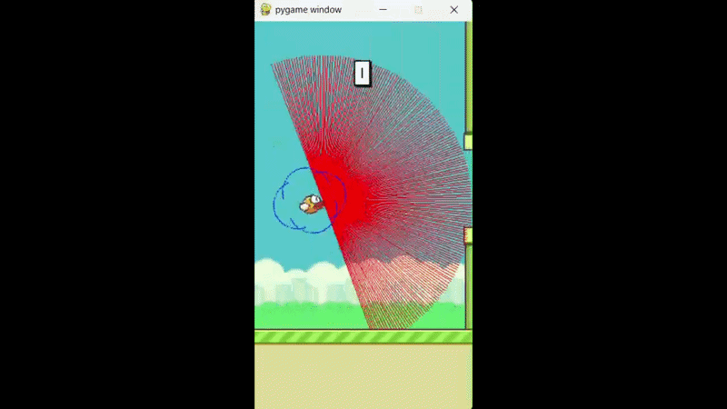

# 🐦 Flappy Bird AI using Deep Q-Network (DQN)

Built using PyTorch and Reinforcement Learning.



## Overview

This project implements a **Deep Q-Network (DQN)** agent that learns to play Flappy Bird using **Reinforcement Learning**.

The agent starts with no prior knowledge of the game and learns through trial and error by interacting with the environment, storing experiences in replay memory, and improving its policy over time.

---

## 🚀 Features

- Deep Q-Network (DQN)
- Experience Replay
- Target Network Synchronization
- Epsilon-Greedy Exploration
- PyTorch-based Neural Network
- Gymnasium Flappy Bird Environment

---

## 🧠 How It Works

The agent observes the game state and chooses between two actions:

| Action | Description |
|----------|------------|
| 0 | Do Nothing |
| 1 | Flap |

The neural network predicts Q-values for each action, and the agent selects actions that maximize long-term rewards.

---

## 📂 Project Structure

```text
FlappyBird_RL/
│
├── agent.py
├── dqn.py
├── experience_replay.py
├── game_flappy_bird.py
├── parameters.yaml
├── README.md
├── .gitignore
│
└── runs/
    └── flappybirdv0.pt
```

---


## 🏗️ Network Architecture

```text
State (12)
   │
   ▼
Linear(12 → 256)
   │
  ReLU
   │
   ▼
Linear(256 → 256)
   │
  ReLU
   │
   ▼
Linear(256 → 2)
   │
   ▼
Q-values for Actions
```

---

## ⚙️ Hyperparameters

```yaml
epsilon_init: 1.0
epsilon_min: 0.05
epsilon_decay: 0.9995

gamma: 0.99
alpha: 0.001

replay_memory_size: 100000
mini_batch_size: 32

network_sync_rate: 100
reward_threshold: 1000
```

---

## 📈 Training

The agent was trained using:

- Deep Q-Learning
- Experience Replay Buffer
- Target Network
- Epsilon Decay Strategy

During training, the agent gradually learned to survive longer and successfully navigate through obstacles.

---

## 🛠️ Tech Stack

- Python
- PyTorch
- Gymnasium
- Flappy-Bird-Gymnasium
- YAML

---

## 🔧 Installation

Clone the repository:

```bash
git clone https://github.com/syedshavezjafar/FlappyBird-RL-DQN.git
cd FlappyBird-RL-DQN
```

Install dependencies:

```bash
pip install torch gymnasium flappy-bird-gymnasium pygame pyyaml
```

---

## ▶️ Train the Agent

```bash
python agent.py flappybirdv0 --train
```

---

## 🎮 Run the Trained Agent

```bash
python agent.py flappybirdv0
```

---

## 📚 Key Learnings

Through this project, I gained practical experience with:

- Reinforcement Learning
- Deep Q-Learning (DQN)
- Neural Network Training
- Exploration vs Exploitation
- Experience Replay
- Target Networks
- PyTorch

---

## 🚀 Future Improvements

- Double DQN (DDQN)
- Dueling DQN
- Prioritized Experience Replay
- Hyperparameter Optimization
- Training Visualization Dashboard

---

## 👨‍💻 Author

**Syed Shavez Jafar**

Engineering Student | AI & Machine Learning Enthusiast

- LinkedIn: www.linkedin.com/in/syed-shavez-jafar-a3b670327
- GitHub: https://github.com/syedshavezjafar